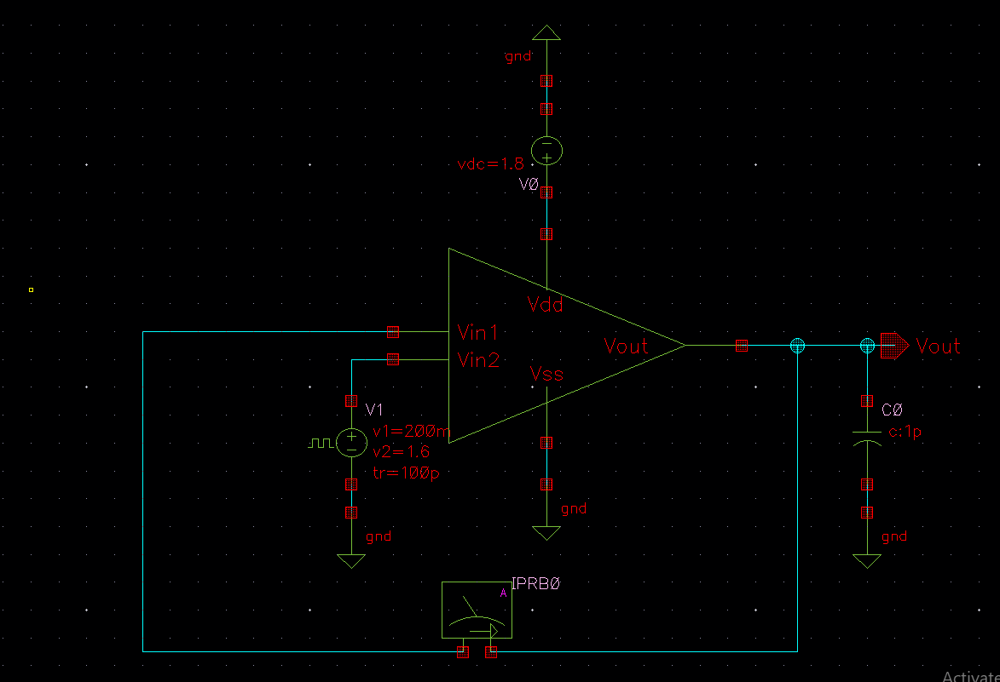
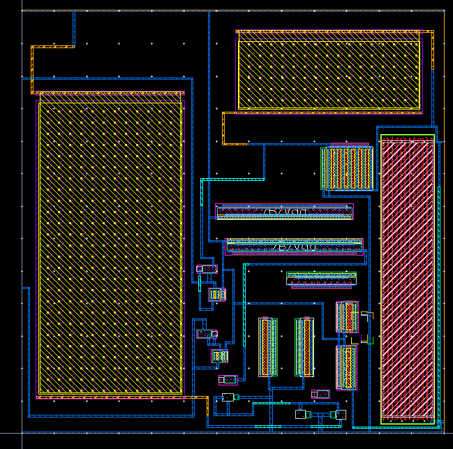
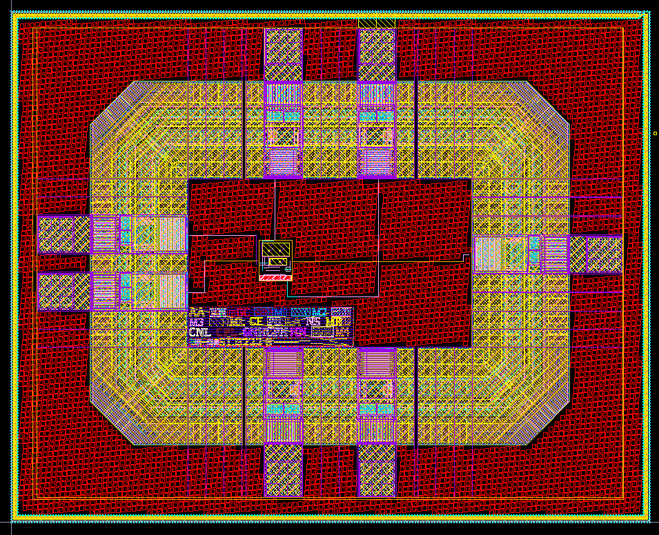
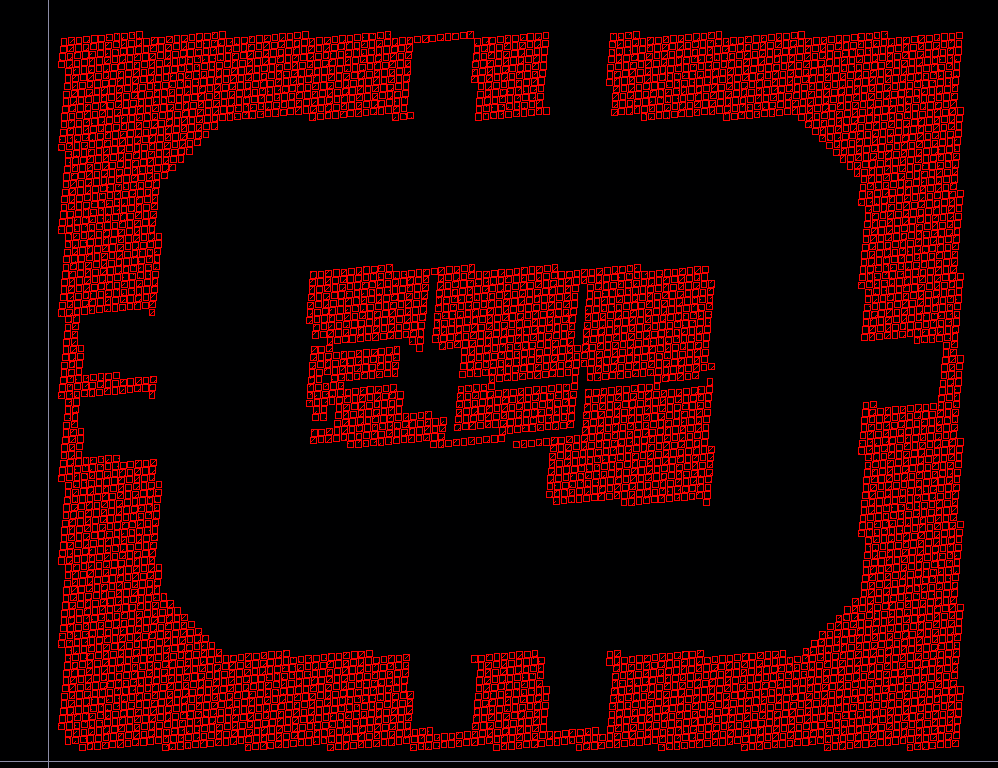
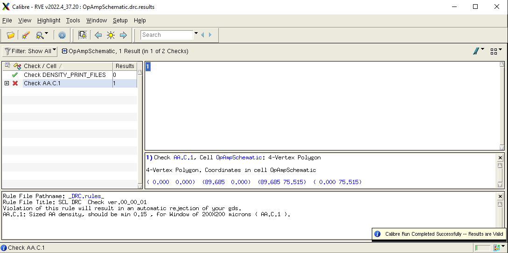
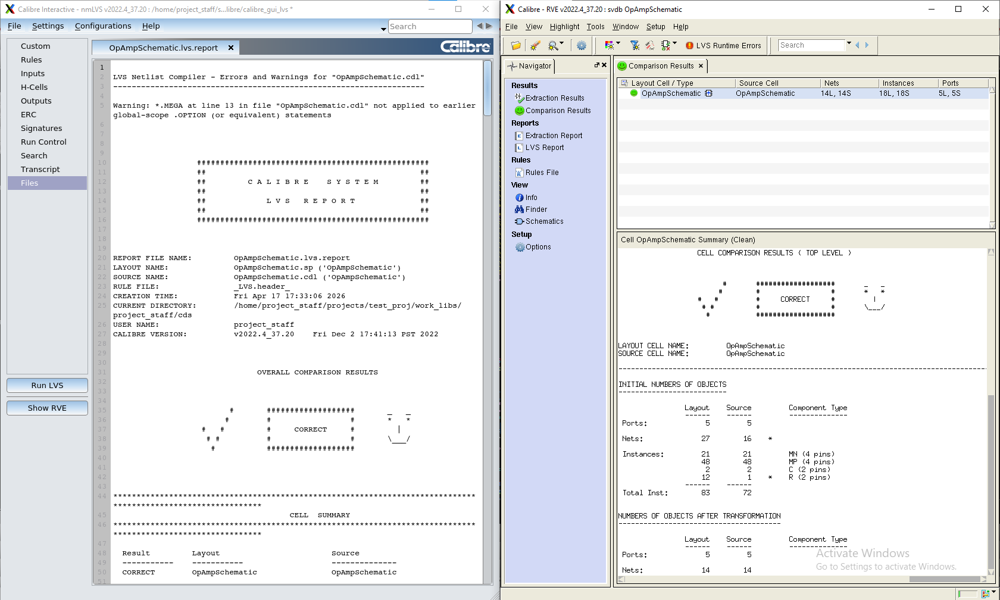

# CMOS-OpAmp-Design-in-Cadence-180nm-with-full-simulation-layout-tapeout-
Full custom CMOS Op-Amp design in Cadence: schematic to tapeout including layout, DRC/LVS, PEX, Monte Carlo, PVT corners, and pre/post-layout performance validation.

## Overview

This project demonstrates the complete custom IC design flow of a Two-Stage Operational Amplifier, starting from transistor-level schematic design and ending with tape-out ready GDSII generation.

The design was implemented using the SCL 180nm CMOS technology and verified through industry-standard physical sign-off checks including DRC, LVS, and Parasitic Extraction (PEX).

Key stages covered:

- Schematic Design
- Analog Simulation & Characterization
- Layout Design
- DRC Verification
- LVS Verification
- Parasitic Extraction (PEX)
- Post-Layout Simulation
- IO Pad Ring Integration
- Seal Ring Implementation
- Dummy Fill Insertion
- GDSII Tape-Out Generation

## Design Flow

Schematic Design
      ↓
Pre-Layout Simulation
      ↓
Layout Implementation
      ↓
DRC Clean
      ↓
LVS Match
      ↓
PEX Extraction
      ↓
Post-Layout Verification
      ↓
Pad Ring Integration
      ↓
Seal Ring & Dummy Fill
      ↓
Final GDSII Generation

## Specifications

| Parameter | Value |
|------------|--------|
| Technology | SCL 180nm CMOS |
| Supply Voltage | 1.8 V |
| Architecture | Two-Stage Op-Amp |
| Load Capacitance | 1 pF |
| Verification | DRC, LVS, PEX |
| Output | Tape-Out Ready GDSII |

## Layout Snapshots

### Test Bench

### Core Layout

### Full Chip Layout

### Dummy

### DRC have only last error which is clear by dummy

### LVS Matched

## Tools

- Cadence Virtuoso
- Spectre Simulator
- Calibre DRC
- Calibre LVS
- Calibre PEX
- SCL 180nm PDK

## Key Achievements

- Designed a Two-Stage Operational Amplifier in 180nm CMOS.
- Completed full-custom analog layout.
- Achieved DRC-clean layout.
- Achieved LVS-matched design.
- Performed parasitic extraction and post-layout verification.
- Integrated IO Pad Ring and Seal Ring.
- Generated tape-out ready GDSII database.

## Repository Structure

├── schematic/
├── layout/
├── simulations/
├── verification/
├── images/
├── docs/
└── README.md

## Disclaimer

This repository is intended for educational and research purposes. Proprietary PDK files, foundry data, and confidential design assets are not included.
